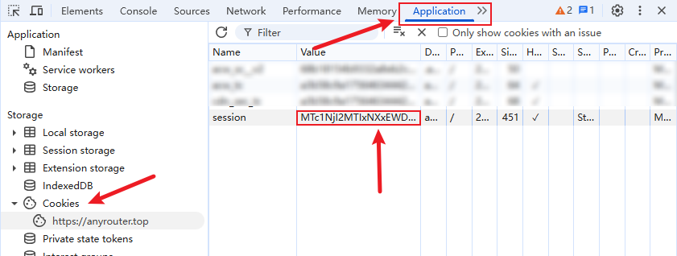
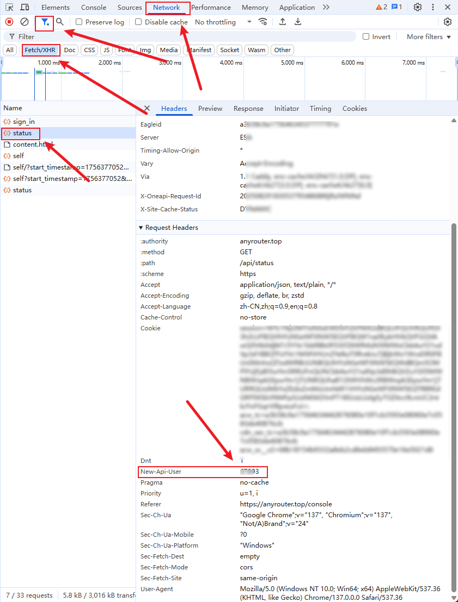
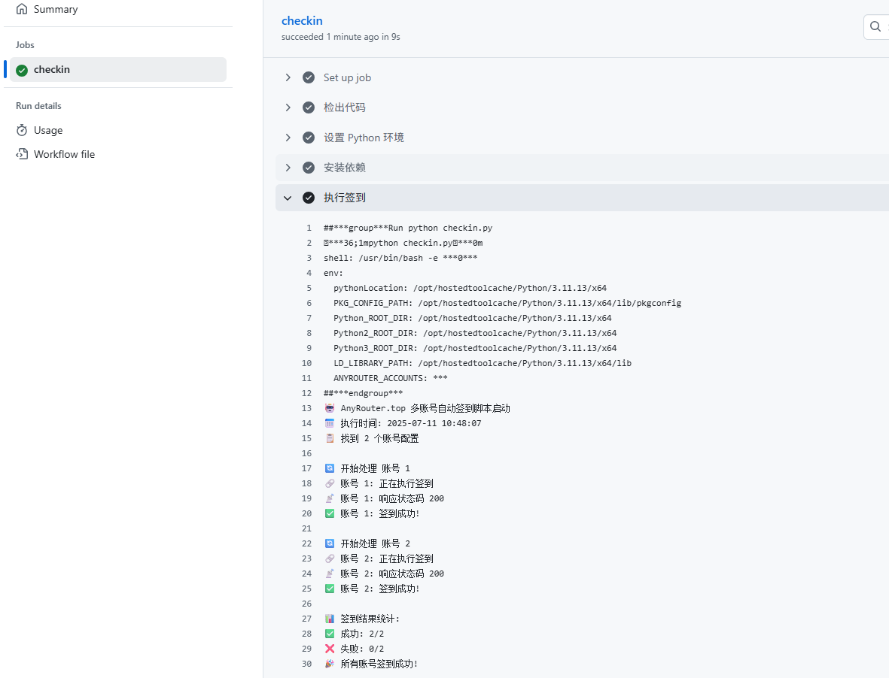

# 🤖 Any Router 多账号自动签到

✨ 多平台多账号自动签到，理论上支持所有 NewAPI、OneAPI 平台，目前内置支持 Any Router、Agent Router 与 Tribios API，其它可根据文档进行摸索配置。

🔗 推荐搭配使用[Auo](https://github.com/millylee/auo)，支持任意 Claude Code Token 切换的工具。

**⭐ 维护开源不易，如果本项目帮助到了你，请帮忙点个 Star，谢谢!**

🎁 用于 Claude Code 中转站 Any Router 网站多账号每日签到，一次 $25，限时注册即送 100 美金，[点击这里注册](https://anyrouter.top/register?aff=0W9A)。业界良心，支持 Claude Sonnet 4.5、GPT-5-Codex、Claude Code 百万上下文（使用 `/model sonnet[1m]` 开启），`gemini-2.5-pro` 模型。

## ✨ 功能特性

- ✅ 多平台支持（兼容 NewAPI 与 OneAPI）
- ✅ 单个/多账号自动签到
- ✅ 余额变化监控
- ✅ 智能通知策略（仅在失败或余额变化时推送）
- ✅ 多种机器人通知（邮箱、钉钉、飞书、企业微信、PushPlus、Server酱）
- ✅ WAF 绕过支持
- ✅ 无头模式配置（适用于服务器和本地调试）
- ✅ 友好的日志输出格式

## 🚀 使用方法

### 1️⃣ Fork 本仓库

点击右上角的 "Fork" 按钮，将本仓库 fork 到你的账户。

### 2️⃣ 获取账号信息

对于每个需要签到的账号，你需要获取：

1. **🍪 Cookies**: 用于身份验证
2. **👤 API User**: 用于请求头的 new-api-user 参数（自己配置其它平台时该值需要注意匹配）

#### 🤖 自动获取 Cookies 和 API User（仅支持账号密码登录）

如果你的账号支持账号密码登录，可以直接使用[get_user/auto_login.py](get_user/auto_login.py)脚本获取`cookie`和`API User`

1. 将[user.json.example](get_user/user.json.example)复制一份重命名为：user.json，并修改里面的内容

```json
[
  {
    "name": "主账号",
    "provider": "网站提供方",
    "username": "你的用户名",
    "password": "你的登录密码"
  },
  {
    "name": "备用账号",
    "provider": "网站提供方",
    "username": "你的用户名",
    "password": "你的登录密码"
  }
]
```

> 💡 注意：默认提供的是多账号方式，如只有一个账号，删除多余的即可

2. 安装依赖并运行脚本

```bash
# 安装依赖
uv sync --dev

# 安装 Playwright 浏览器
uv run playwright install chromium

# 运行自动登录脚本
cd get_user
python auto_login.py
```

3. 查看生成的账号信息

脚本运行成功后会在 `get_user` 目录下生成 `anyrouter_accounts.json` 文件，包含所有账号的 cookies 和 api_user 信息：

```json
[
  {
    "name": "主账号",
    "provider": "anyrouter.top",
    "cookies": {
      "session": "自动获取的session值"
    },
    "api_user": "自动获取的用户ID"
  }
]
```

4. 转换为单行格式（可选）

如果你的有些账号无法使用账号密码登录，需要手动获取，并添加到`anyrouter_accounts.json`中,执行下一步的脚步转换为单行格式以便复制到 GitHub Secrets中：

```bash
python merge_accounts.py
```

这会生成一个单行格式的`anyrouter_accounts.txt`，方便直接复制粘贴到 GitHub 环境变量中

#### 🔧 手动获取 Cookies

1. 打开浏览器，访问 https://anyrouter.top/
2. 登录你的账户
3. 打开开发者工具 (F12)
4. 切换到 "Application" 或 "存储" 选项卡
5. 找到 "Cookies" 选项
6. 复制所有 cookies

#### 🔧 手动获取 API User

通常在网站的用户设置或 API 设置中可以找到，每个账号都有唯一的标识。

### 3️⃣ 设置 GitHub Environment Secret

1. 在你 fork 的仓库中，点击 "Settings" 选项卡
2. 在左侧菜单中找到 "Environments" -> "New environment"
3. 新建一个名为 `production` 的环境
4. 点击新建的 `production` 环境进入环境配置页
5. 点击 "Add environment secret" 创建 secret：
    - Name: `ANYROUTER_ACCOUNTS`
    - Value: 你的多账号配置数据

### 4️⃣ 多账号配置格式

支持单个与多个账号配置，可选 `name` 和 `provider` 字段：

```json
[
  {
    "name": "我的主账号",
    "api_user": "用户ID",
    "provider": "anyrouter",
    "cookies": {
      "session": "用户session"
    }
  },
  {
    "name": "我的备用账号",
    "api_user": "用户ID",
    "provider": "agentrouter",
    "cookies": {
      "session": "用户session"
    }
  },
  {
    "name": "Tribios账号",
    "api_user": "用户ID",
    "provider": "tribiosapi",
    "cookies": {
      "session": "用户session"
    }
  }
]
```

**📋 字段说明**：

- `cookies` (必需)：用于身份验证的 cookies 数据
- `api_user` (必需)：用于请求头的 new-api-user 参数
- `provider` (可选)：指定使用的服务商，支持 `anyrouter`、`agentrouter`、`tribiosapi` 或自定义服务商
- `name` (可选)：自定义账号显示名称，用于通知和日志中标识账号

**📝 默认值说明**：

- 如果未提供 `provider` 字段，默认使用 `anyrouter`（向后兼容）
- 如果未提供 `name` 字段，会使用 `Account 1`、`Account 2` 等默认名称
- `anyrouter`、`agentrouter` 和 `tribiosapi` 配置已内置，无需额外配置

接下来获取 cookies 与 api_user 的值。

通过 F12 工具，切到 Application 面板，拿到 session 的值，最好重新登录下，该值 1 个月有效期，但有可能提前失效，失效后报 401 错误，到时请再重新获取。



通过 F12 工具，切到 Network 面板，可以过滤下，只要 Fetch/XHR，找到带 `New-Api-User`，这个值正常是 5 位数，如果是负数或者个位数，正常是未登录。



### 5️⃣ 启用 GitHub Actions

1. 在你的仓库中，点击 "Actions" 选项卡
2. 如果提示启用 Actions，请点击启用
3. 找到 "AnyRouter 自动签到" workflow
4. 点击 "Enable workflow"

### 6️⃣ 测试运行

你可以手动触发一次签到来测试：

1. 在 "Actions" 选项卡中，点击 "AnyRouter 自动签到"
2. 点击 "Run workflow" 按钮
3. 确认运行



## ⏰ 执行时间

- 📅 脚本每6小时执行一次（1. action 无法准确触发，基本延时 1~1.5h；2. 目前观测到 anyrouter 的签到是每 24h 而不是零点就可签到）
- 🔄 你也可以随时手动触发签到

## ⚠️ 注意事项

- ✔️ 请确保每个账号的 cookies 和 API User 都是正确的
- 📊 可以在 Actions 页面查看详细的运行日志
- 🔧 支持部分账号失败，只要有账号成功签到，整个任务就不会失败
- 🔑 报 401 错误，请重新获取 cookies，理论 1 个月失效，但有 Bug，详见 [#6](https://github.com/millylee/anyrouter-check-in/issues/6)
- 💾 请求 200，但出现 Error 1040（08004）：Too many connections，官方数据库问题，目前已修复，但遇到几次了，详见 [#7](https://github.com/millylee/anyrouter-check-in/issues/7)
- 🏠 **如果遇到 403 错误**：某些平台（如 tribiosapi）的 session cookie 绑定了 IP 地址，导致 GitHub Actions 无法使用。解决方案：使用自托管 Runner，详见 [SELF_HOSTED_RUNNER.md](SELF_HOSTED_RUNNER.md)

## 📦 配置示例

### 基础配置（向后兼容）

假设你有两个账号需要签到，不指定 provider 时默认使用 anyrouter：

```json
[
  {
    "cookies": {
      "session": "abc123session"
    },
    "api_user": "user123"
  },
  {
    "cookies": {
      "session": "xyz789session"
    },
    "api_user": "user456"
  }
]
```

### 多服务商配置

如果你需要同时使用多个服务商（如 anyrouter 和 agentrouter）：

```json
[
  {
    "name": "AnyRouter 主账号",
    "provider": "anyrouter",
    "cookies": {
      "session": "abc123session"
    },
    "api_user": "user123"
  },
  {
    "name": "AgentRouter 备用",
    "provider": "agentrouter",
    "cookies": {
      "session": "xyz789session"
    },
    "api_user": "user456"
  }
]
```

## 🔧 自定义 Provider 配置（可选）

默认情况下，`anyrouter`、`agentrouter` 已内置配置，无需额外设置。如果你需要使用其他服务商，可以通过环境变量 `PROVIDERS` 配置：

### 基础配置（仅域名）

大多数情况下，只需提供 `domain` 即可，其他路径会自动使用默认值：

```json
{
  "customrouter": {
    "domain": "https://custom.example.com"
  }
}
```

### 完整配置（自定义路径）

如果服务商使用了不同的 API 路径、请求头或需要 WAF 绕过，可以额外指定：

```json
{
  "customrouter": {
    "domain": "https://custom.example.com",
    "login_path": "/auth/login",
    "sign_in_path": "/api/checkin",
    "user_info_path": "/api/profile",
    "api_user_key": "New-Api-User",
    "bypass_method": "waf_cookies"
  }
}
```

**🛡️ 关于 `bypass_method`**：

- 不设置或设置为 `null`：直接使用用户提供的 cookies 进行请求（适合无 WAF 保护的网站）
- 设置为 `"waf_cookies"`：使用 Playwright 打开浏览器获取 WAF cookies 后再进行请求（适合有 WAF 保护的网站）

> 💡 注：`anyrouter` 和 `agentrouter` 已内置默认配置，无需在 `PROVIDERS` 中配置

### 在 GitHub Actions 中配置

1. 进入你的仓库 Settings -> Environments -> production
2. 添加新的 secret：
    - Name: `PROVIDERS`
    - Value: 你的 provider 配置（JSON 格式）

**📋 字段说明**：

- `domain` (必需)：服务商的域名
- `login_path` (可选)：登录页面路径，默认为 `/login`（仅在 `bypass_method` 为 `"waf_cookies"` 时使用）
- `sign_in_path` (可选)：签到 API 路径，默认为 `/api/user/sign_in`
- `user_info_path` (可选)：用户信息 API 路径，默认为 `/api/user/self`
- `api_user_key` (可选)：API 用户标识请求头名称，默认为 `new-api-user`
- `bypass_method` (可选)：WAF 绕过方法
    - `"waf_cookies"`：使用 Playwright 打开浏览器获取 WAF cookies 后再执行签到
    - 不设置或 `null`：直接使用用户 cookies 执行签到（适合无 WAF 保护的网站）

**📝 配置示例**（完整）：

```json
{
  "customrouter": {
    "domain": "https://custom.example.com",
    "login_path": "/auth/login",
    "sign_in_path": "/api/checkin",
    "user_info_path": "/api/profile",
    "api_user_key": "x-user-id",
    "bypass_method": "waf_cookies"
  }
}
```

**📌 内置配置说明**：

- `anyrouter`：
    - `domain: "https://anyrouter.top"`
    - `bypass_method: "waf_cookies"`（需要先获取 WAF cookies，然后执行签到）
    - `sign_in_path: "/api/user/sign_in"`
- `agentrouter`：
    - `domain: "https://agentrouter.org"`
    - `bypass_method: null`（直接使用用户 cookies 执行签到）
    - `sign_in_path: "/api/user/sign_in"`
- `tribiosapi`：
    - `domain: "https://www.tribiosapi.top"`
    - `bypass_method: null`（直接使用用户 cookies 执行签到）
    - `checkin_path: "/api/user/checkin"`（支持新版自动签到接口）

**⚠️ 重要提示**：

- `PROVIDERS` 是可选的，不配置则使用内置的 `anyrouter`、`agentrouter` 和 `tribiosapi`
- 自定义的 provider 配置会覆盖同名的默认配置

## 🔔 开启通知

脚本支持多种通知方式，可以通过配置以下环境变量开启。

### 📊 通知策略配置

- `ALWAYS_NOTIFY`: 是否总是发送通知
  - 设置为 `true`/`1`/`yes`：每次运行都发送通知（无论成功或失败）
  - 设置为 `false`/`0`/`no` 或不设置：仅在以下情况发送通知
    - ❌ 有账号签到失败
    - 🆕 首次运行
    - 💰 余额发生变化

**💡 默认行为**：不设置时默认为 `false`，仅在失败或余额变化时推送通知（节省通知资源）

### 📱 支持的通知渠道

如果 `webhook` 有要求安全设置，例如钉钉，可以在新建机器人时选择自定义关键词，填写 `AnyRouter`。

#### 📧 邮箱通知

- `EMAIL_USER`: 发件人邮箱地址
- `EMAIL_PASS`: 发件人邮箱密码/授权码
- `CUSTOM_SMTP_SERVER`: 自定义发件人SMTP服务器(可选)
- `EMAIL_TO`: 收件人邮箱地址

#### 💬 钉钉机器人

- `DINGDING_WEBHOOK`: 钉钉机器人的 Webhook 地址

#### 📲 飞书机器人

- `FEISHU_WEBHOOK`: 飞书机器人的 Webhook 地址

#### 💼 企业微信机器人

- `WEIXIN_WEBHOOK`: 企业微信机器人的 Webhook 地址

#### 📱 PushPlus 推送

- `PUSHPLUS_TOKEN`: PushPlus 的 Token

#### 🔔 Server酱

- `SERVERPUSHKEY`: Server酱的 SendKey

### 📝 通知格式示例

**✅ 全部成功时：**
```
🔔 AnyRouter 签到提醒
⏰ [时间] 2025-10-18 00:44:18

💰 [余额] Linux.do账号
💰 已使用: $74.77, 当前余额: 💵$1250.23

📊 [统计] 签到结果统计:
✅ [成功] 【Linux.do账号】、【司予账号】账号签到成功！
🎉 [成功] 所有账号签到成功！
```

**❌ 部分失败时：**
```
🔔 AnyRouter 签到提醒
⏰ [时间] 2025-10-18 00:44:18

💰 [余额] Linux.do账号
💰 已使用: $74.77, 当前余额: 💵$1250.23

📊 [统计] 签到结果统计:
✅ [成功] 【Linux.do账号】签到成功！
❌ [失败] 【司予账号】签到失败！
⚠️ [警告] 部分账号签到成功！
```

### ⚙️ 配置步骤

1. 在仓库的 Settings -> Environments -> production -> Environment secrets 中添加上述环境变量
2. 每个通知方式都是独立的，可以只配置你需要的推送方式
3. 如果某个通知方式配置不正确或未配置，脚本会自动跳过该通知方式

### 📋 配置示例

```bash
# .env 文件示例
ALWAYS_NOTIFY=false  # 可选，不设置则默认为 false
PUSHPLUS_TOKEN=your_pushplus_token
WEIXIN_WEBHOOK=https://qyapi.weixin.qq.com/cgi-bin/webhook/send?key=xxx
```

## 🔍 故障排除

如果签到失败，请检查：

1. ✔️ 账号配置格式是否正确
2. 🍪 cookies 是否过期
3. 👤 API User 是否正确
4. 🌐 网站是否更改了签到接口
5. 📋 查看 Actions 运行日志获取详细错误信息

## 💻 本地开发环境设置

如果你需要在本地测试或开发，请按照以下步骤设置：

### 🖥️ 浏览器模式配置

在 `checkin.py` 文件顶部，你可以配置浏览器模式：

```python
# 浏览器无头模式：True=不显示浏览器窗口（服务器环境），False=显示浏览器窗口（本地调试）
HEADLESS = True
```

**🔧 配置说明**：
- `HEADLESS = True`（默认）：无头模式，适用于服务器环境或自动化运行
- `HEADLESS = False`：显示浏览器窗口，适用于本地调试，可以看到浏览器操作过程

### 📦 安装和运行

```bash
# 安装所有依赖
uv sync --dev

# 安装 Playwright 浏览器
uv run playwright install chromium

# 创建 .env 文件并配置（注意：JSON 必须是单行格式）
# 示例：
# ANYROUTER_ACCOUNTS=[{"name":"账号1","cookies":{"session":"xxx"},"api_user":"12345"}]
# PROVIDERS={"agentrouter":{"domain":"https://agentrouter.org"}}

# 运行签到脚本
uv run checkin.py
```

## 🧪 测试

```bash
uv sync --dev

# 安装 Playwright 浏览器
uv run playwright install chromium

# 运行测试
uv run pytest tests/
```

## 📜 免责声明

本脚本仅用于学习和研究目的，使用前请确保遵守相关网站的使用条款.

## 🎉 更新日志

### ✨ 最新更新 (2025-12-29)

- ✨ 新增内置支持 Tribios API 平台
- 🎯 优化签到状态显示：明确区分"新签到"和"已签到"状态
- 📊 改进统计信息：分别显示新签到、已签到和失败的账号
- 🔧 优化返回值结构：函数返回包含签到状态的详细信息

### 之前更新 (2025-12-22)

- ✨ 新增自动签到功能（支持 `/api/user/checkin` 新接口）
- ✨ 新增签到状态查询功能（支持 `/api/user/checkin/status` 接口）
- 🔄 优化签到逻辑：优先使用新的自动签到接口，兼容旧版接口
- ⚡ 智能判断：已签到时自动跳过，避免重复签到

### 更早更新

- 🔧 修复通知推送问题（环境变量加载优化）
- 💰 优化余额显示格式（已使用在前，添加💵符号）
- ⏰ 优化时间显示格式
- 📊 改进签到结果统计格式（全部成功时合并显示）
- 🔔 优化通知策略（默认只在失败或余额变化时通知）
- 🖥️ 添加浏览器无头模式配置（HEADLESS 常量）
- 📝 优化日志输出格式，更加易读
